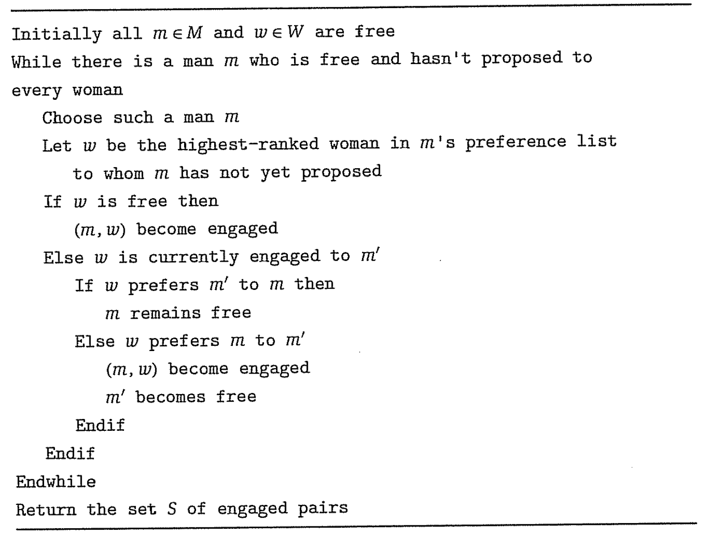

El algoritmo Gale-Shapley resuelve **parejas estables (stable matching)**.

# Planteo
- Conjuntos $M=\{m_1, ..., m_n\}$ (_men_) y $W=\{w_1, ..., w_n\}$ (_women_)
- Matching: $S \subset M \times W$ (conjunto de parejas)
- Lista de preferencia: todos tienen un orden de preferencia de los miembros del sexo opuesto

# Tipos de matching
- **Matching**: Cada miembro de $S$ y cada miembro de $W$ aparece **como mucho** una vez en $S \subset M \times W$
- **Matching perfecto**: Cada miembro de $S$ y cada miembro de $W$ aparece **exactamente** una vez en $S' \subset M \times W$
- **Matching estable**: Matching **perfecto** en que no existen 2 personas que serían más felices juntas que con sus parejas. Nadie se escapa con nadie.

# Algoritmo

# Algoritmo simplificado
```
mientras exista un hombre M soltero:
    M se propone a todas las mujeres W según su orden de preferencia. La mujer W sólo acepta si le conviene o si está soltera.
```
El algoritmo se entiende mejor visualizando un baile circa 1950, barrio de Barracas, se escucha Tango de fondo. Todo está en blanco y negro. Los hombres se amenazan con cuchillos, las mujeres sólo se quieren casar.

# Propiedades del algoritmo
- (1.1) Desde que reciben su primera propuesta, las **mujeres permanecen de novias** y sus parejas son cada vez **mejores**
- (1.2) Los **hombres** tienen parejas cada vez **peores**.
- (1.3) El algoritmo es $O(n^2)$. Hay $n^2$ parejas posibles.
- (1.4) Si $m$ no está de novio, es porque hay alguna mujer a la cual no se le propuso. [Demostración pendiente]
- (1.5) $S$ retornado al finalizar el algoritmo es un **perfect matching** [Demostración pendiente]
- (1.6) $S$ retornado al finalizar el algoritmo es un **stable matching** [Demostración pendiente]
- (1.7) Los **hombres** tienen sus **mejores parejas** [Demostración pendiente]
- (1.8) Las **mujeres** tienen sus **peores parejas** [Demostración pendiente]