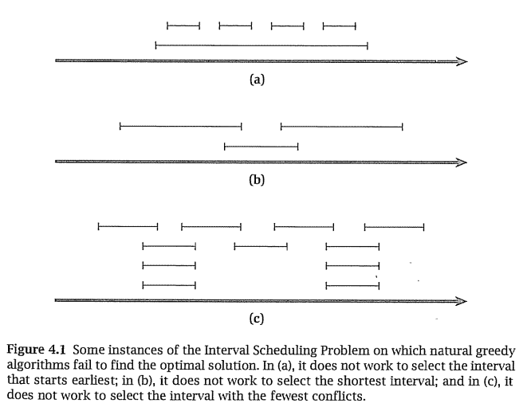

# 4.1 Interval scheduling

Algoritmo que funciona: elegir los trabajos en el orden de su finishing time.

## Análisis del algoritmo
Esta sección demuestra la optimalidad del algoritmo PENDIENTE

# 4.1 Interval partitioning problem
Organizar todos los intervalos usando la menor cantidad de recursos (servidores, máquinas, etc.) posibles.

## Análisis del algoritmo
- (4.4) Hacen falta al menos $d$ recursos para agendar todos los intervalos (donde $d$ es la cantidad de intervalos que se superponen)
- (4.5) (4.6) El algoritmo planteado es óptimo [PENDIENTE]

# 4.2 Scheduling to minimize lateness

## Planteo
Esta vez hay **1 sola** máquina/servidor/recurso pero los trabajos no vienen con **inicio** y **fin** sino una **duración** y una **fecha límite**.

Entradas:
- $s$: fecha y hora de inicio
- $d_i$: _deadline_ o fecha límite del trabajo $i$
- $t_i$: duración del trabajo $i$

Salidas:
- $s(i)$: inicio del trabajo $i$

Más notación
- $f(i)=s(i)+t_i$: fin del trabajo $i$
- $f=s+\sum_{\forall i} t_i$: fin de todos los trabajos
- $l_i = f(i)-d_i$ (tardanza ó _lateness_ del trabajo $i$)
## Objetivo
Minimizar la **máxima _lateness_**: $max_{\forall i} l_i$
## Algoritmo
Elegir los trabajos en el orden de su fecha límite o _deadline_.

## Análisis del algoritmo
Demostración de optimalidad PENDIENTE

# 4.4 Disjkstra

PENDIENTE

# 4.5 Mininmum spanning tree
Encontrar el subarbol de menor peso en un grafo con aristas pesadas.
- **Kruskal**: **Agregar aristas** de a una empezando por la más liviana, **sin introducir ciclos**.
- **Reverse-Delete**: **Sacar aristas** de a una empezando por la más pesada, **sin desconectar el grafo**.
- **Prim**: Hacer crecer un árbol a partir de algún vértice, agregando a cada paso la arista más liviana posible

## Análisis y demostraciones de optimalidad
PENDIENTE

# 4.6 The Union-Find data structure

PENDIENTE

# 4.8 Huffman codes and data compression

PENDIENTE