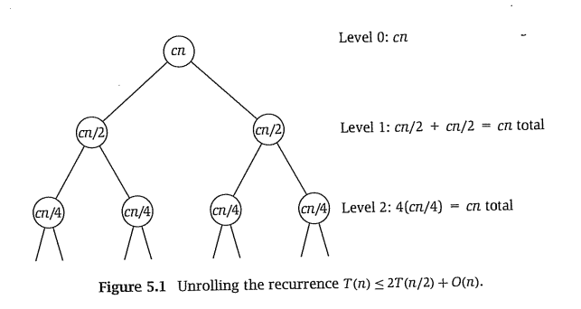

Definición general:

```
Resolver:
    1. dividir problema en partes
    2. resolver cada parte por medio de este mismo algoritmo
    3. recombinar las partes
```

# Análisis temporal de mergesort
Si el algoritmo corre en tiempo $O(T(n))$ y se divide en 2 partes el algoritmo, $c$ constante:

$$
T(n) \leq 2T(n/2) + cn
$$

$$
T(2) \leq c
$$

- Paso 1: $O(n)$
- Paso 2: $O(2T(n/2))$
- Paso 3: $O(n)$



- **Costo temporal para cada nivel**: Para el nivel $j$, la ejecución es $O(cn/(2^j))$ y se ejecuta $2^j$ veces, entonces cada nivel es, en total, $O(cn/(2^j)) \times (2^j)$, es decir, $O(n)$. 
- **Cantidad de niveles** El árbol tiene $\log_2 n$ niveles porque en el nivel en el cual $n=2^j$, llegás al caso base, el cual toma tiempo constante.

Así, en el caso de mergesort (en el cual el problema se divide en 2), el costo es $O(n \times \log_2 n )$. En general, para todos los problemas donde se aplica división y conquista dividiendo el problema en una cantidad de problemas constante, el costo es $O(n \times \log n )$ (demostración pendiente para una constante distinta de 2).

# Integer multiplication
PENDIENTE