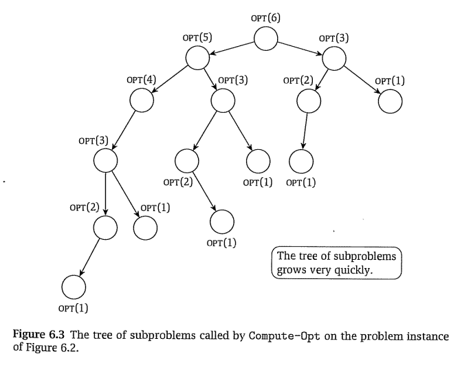

# Weighted interval scheduling
## Planteo
Si se tienen $n$ trabajos donde:
- $s_i$: **inicio** del trabajo $i$
- $f_i$: **fin** del trabajo $i$
- $v_i$: **peso** del trabajo $i$

Dos trabajos son compatibles si no se superponen en el tiempo.

## Objetivo
Conjunto $S \subset \{ 1, ..., n \}$ de trabajos mutuamente compatibles que maximice $\sum_{i \in S} v_i$ .

## Construcción del algoritmo

### 1. Etiquetado
Supongamos que los intervalos $i$ están etiquetados de forma que: $f_1 \leq f_2 \leq ... \leq f_n$.

### 2. Definición de $p(j)$
Sea $p(j)$ el mayor $i<j$ tales que los intervalos $i$ y $j$ son compatibles. $p(j)$ podría pensarse intuitivamente como el intervalo inmediatamente previo al $j$.

### 3. Definición de $\operatorname{opt}(j)$
$\operatorname{opt}(j)$ es el óptimo si el problema no fuera hasta $n$ sino hasta $j$

$$
\operatorname{opt}(j)=\max_{S \subset \{1,...,j\}}\sum_{i \in S} v_i
$$

El objetivo del Weighted interval scheduling podría definirse como: "Encontrar el conjunto $S \subset \{ 1, ..., n \}$ de trabajos mutuamente compatibles que maximice $\operatorname{opt}(n)$".

### 4. Definición recursiva de $\operatorname{opt}(j)$

El trabajo $j$ puede pertenecer o no al subconjunto de trabajos que alcanza $\operatorname{opt}(j)$.
- Si el trabajo $j$ **pertenece**, entonces $\operatorname{opt}(j)=v_j + \operatorname{opt}(p(j))$ (ya que todos los trabajos entre $j$ y $p(j)$ son incompatibles con el trabajo $j$)
- Si el trabajo $j$ **no pertenece**, entonces $\operatorname{opt}(j)=\operatorname{opt}(j-1)$

Por lo tanto, podemos formular $\operatorname{opt}(j)$ como:

$$
\operatorname{opt}(j)=\max(v_j + \operatorname{opt}(p(j)), \operatorname{opt}(j-1) )
$$

### 5. Exponencialidad del algoritmo recursivo

Suponiendo un problema en el cual $p(j)=j-2 \forall j\in S$, las llamadas a la función $\operatorname{opt}$ para conseguir $\operatorname{opt}(j)$  son $\operatorname{calls}(j)$, que es: 

$$
\operatorname{calls}(j)= 2 + \operatorname{calls}(j-1) + \operatorname{calls}(j-2) \text{ si } j \gt 0
$$

$$
\operatorname{calls}(j)=0 \text{ si } j \leq 0
$$

Resolver la relación de recurrencia nos revela que $\operatorname{calls}(n)$ tiene una componente exponencial, con lo cual un algoritmo que calcule $\operatorname{opt}(n)$ usando valores anteriores pertenece a $O(k^n)$ (orden exponencial).

### 6. Memoización

$\operatorname{opt}(j)$ depende unicamente de $j$ con lo cual puede calcularse una sola vez y almacenarse, reduciendo la complejidad del algoritmo a $O(n)$.

### 7. Algoritmo memoizado

Con una leve alteración se puede calcular la solución $S$ en vez del óptimo $\operatorname{opt}(n)$.

### 8. Algoritmo iterativo
En vez de usar una invocación recursiva se puede iterar hasta $n$ para calcular $\operatorname{opt}(n)$.

# Diseño de algoritmos dinámicos

El problema se resuelve por porgramación dinámica si cumple:

# Segmented Least Squares

## Planteo
Conjunto de puntos $P$, $|P|=n$

$$
P=\{(x_1,y_1),...,(x_n,y_n)\}
$$

donde $x_1 \lt ... \lt x_n$ y $p_i = (x_i,y_i)$

Recta de aproximación $L$, representa la recta $y=ax+b$:

$$
L=(a,b) \in \R^2
$$

Error cuadrático:

$$
\operatorname{Error}(L,P)=\sum_{\forall (x_P,y_P) \in P} (y_P-ax_P-b)^2
$$

La recta $L$ se puede calcular usando esta expresión:

Entonces vamos a hablar de $\operatorname{Error}(P)$, ya que dado $P$ podemos calcular su $L$ y su $\operatorname{Error}(L,P)$.

Sea la penalidad o _penalty_ de una solución (En Machine Learning se suele usar el término _loss_), siendo $S$ un conjunto de conjuntos de puntos contíguos, y $C$ una constante que usamos para penalizar a cada recta.

$$
\operatorname{opt}(P)=\min_{S \text{ particiona } P}\sum_{s \in S}(\operatorname{Error}(s) + C)
$$

La idea es encontrar varias rectas que aproximen un conjunto de puntos. Al algoritmo le gustaría poner $n$ rectas, así que penalizamos con la constante $C$.

## Objetivo
Encontrar una partición $S$ de $P$ en la que los puntos de las partes sean contíguos y que minimice $\operatorname{opt}(S)$.

## Planteo recursivo
$$
e_{i,j}=\operatorname{Error}(\{p_i,...,p_j\})
$$

$$
\operatorname{opt}(j)=\min_{i \in \{1 ... j\}} (e_{i,j}+C+\operatorname{opt}(i-1))
$$

Nótese que aquí se minimiza sobre un conjunto de $j$ elementos, no 2 como antes.

## Algoritmo

# Mochila
## Planteo
Mochila con capacidad $W$, cada uno de los $n$ artículos ocupa $w_i$. Esto es, siendo $S$ el conjunto de artículos seleccionados:

$$
\sum_{i \in S} w_i \leq W
$$

## Objetivo
Maximizar la capacidad ocupada de la mochila. Es decir, hallar un $S$ que maximice:

$$
\max_S \sum_{i \in S} w_i
$$

## Planteo recurrente
Los subproblemas se plantean en términos de dos variables:  $i$ y $w$.

$$
\operatorname{opt}(i,w)=\max_{S \subset \{1, ..., i\}} \sum_{j\in S} w_j \text{ sujeto a } \sum_{j \in S} w_i \leq w
$$

Sea $O$ la solución óptima.
- Si $i \notin O$, se cumple $\operatorname{opt}(i,w) = \operatorname{opt}(i-1,w)$ porque $i$ no aporta al máximo
- Si $i \in O$, se cumple $\operatorname{opt}(i,w) = w_i + \operatorname{opt}(i-1,w-w_i)$ porque $i$ aporta al máximo y resta capacidad disponible

Por lo tanto:

$$
\operatorname{opt}(i,w)=\max(\operatorname{opt}(i-1,w),w_i + \operatorname{opt}(i-1,w-w_i))
$$

## Algoritmo

El algoritmo pertenece a  $O(nW)$

## Planteo para el problema de la mochila posta

Donde los artículos tienen un valor $v_i$:

$$
\operatorname{opt}(i,w)=\max(\operatorname{opt}(i-1,w),v_i + \operatorname{opt}(i-1,w-w_i))
$$

# Sequence alignment
## Planteo

**Palabras** $x$ e $y$, que se denotan como las secuencias ordenadas $x=x_1 x_2 ... x_m$ e $y=y_1 y_2 ... y_n$.

**Posiciones** en cada palabra: son los conjuntos  $P_x = \{ 1, 2, ..., m \} \subset \mathbb{N}$ y $P_y = \{ 1, 2, ..., n \} \subset \mathbb{N}$

## Solución
Un macthing $S \subset P_x \times P_y$ tal que no hay cruces entre los matches, es decir: 

$$
\forall (i,j) \in S, (i',j') \in S: i \lt i', j \lt j'
$$

## Función de costo

Función $\operatorname{gaps}(S)$, cuenta la cantidad de guiones en el matching $S$.

$$
\operatorname{cost}(S)=\delta \operatorname{gaps}(S) + \sum_{(p,q)\in S} \alpha_{x_py_q}
$$

## Planteo recursivo

Para cualquier $(m, n)\in P_x \times P_y$ y una solución óptima $M$, se da uno de:

1. $(m,n)\in M$
2. La posición $m$ de $X$ no está matcheada
3. La posición $n$ de $Y$ no está matcheada

Minimizando sobre las tres decisiones:

$$
\operatorname{opt}(m,n)=\min(\alpha_{x_my_n} + \operatorname{opt}(m-1,n-1), \delta + \operatorname{opt}(m-1,n), \delta + \operatorname{opt}(m,n-1) )
$$

## Algoritmo

El algoritmo explora todo el domínio de $\operatorname{opt}$ en el peor caso, $O(m,n)$. También usa espacio cuadrático (variable $A$).

# Sequence alignment en espacio lineal

Observar que en la relación de recurrencia de sequence alignment se usa solamente el valor inmediato anterior de $n$, entonces en vez de tener toda la matriz de tamaño $m \times n$ en memoria, podemos tener una matriz de tamaño $m \times 2$.

Es como si el algoritmo se fuera olvidando de los resultados anteriores. Se plantea (reemplazando $n-1$ por $0$ y $n$ por $1$)

$$
\operatorname{opt}(m,1)=\min(\alpha_{x_my_n} + \operatorname{opt}(m-1,0), \delta + \operatorname{opt}(m-1,1), \delta + \operatorname{opt}(m,0) )
$$

y en cada iteración se sobreescriben los valores de la columna 0 reemplazandolos por los de la columna 1.

## Algoritmo

# Sequence alignment divide and conquer

Sequence alignment divide and conquer nos permite además extraer el alignment utilizando espacio lineal.

## Planteo alternativo
Cambia la notación. $\operatorname{opt}(i,j)$ pasa a denominarse $f(i,j)$, es el planteo "forwards". El planteo "backwards" es $g$.

$$
f(i,j)=\min(\alpha_{x_jy_j} + f(i-1,j-1), \delta + f(i-1,j), \delta + f(i,j-1) )
$$

$$
g(i,j)=\min(\alpha_{x_{j+1}y_{j+1}} + g(i+1,j+1), \delta + g(i+1,j), \delta + g(i,j+1) )
$$

Los algoritmos de espacio no lineal y de espacio lineal se pueden construir para este planteo.

## Propiedades

6.19: el alignment que contiene $(i,j)$ tiene costo $f(i,j)+g(i,j)$

DEMOSTRACIÓN PENDIENTE, se puede intuir de las definiciones.

6.20: Para todo $k$ existe un $q$ que minimiza $f(q,k)+g(q,k)$. El alignment que incluye $(q,k)$ es el óptimo.

## Algoritmo

Con los llamados a Space-Efficient-Alignment se consigue la información para encontrar el $q$ que minimiza $f(q,n/2)+g(q,n/2)$.

## Tiempo de ejecución
(demostración 6.21)

El algoritmo tiene una etapa no recursiva $O(mn)$ y luego dos llamdos recursivos. Sea el algoritmo parte de la família$O(T(m,n))$

$$T(m,n) \leq cmn + T(q,n/2)+T(m-q,n/2)$$
$$T(m,2) \leq cm$$
$$T(n,2) \leq cn$$

Se resuelve esta recurrencia suponiendo $T(m,n)\leq kmn$

MALISIMA ESTA DEMOSTRACIÓN, NO LE CREO NADA.

# Shortest paths in a graph (Bellman-Ford)

## Planteo

$G=(V,E)$ es un grafo dirigido cuyas aristas tienen un peso $c_{ij} \forall (i,j) \in E$. $c_{ij}$ puede ser negativo con lo cual no se puede aplicar Dijkstra. Se asume que el grafo no tiene ciclos negativos.

## Objetivo

Encontrar caminos cuyo costo sea el menor posible, asumiendo que el grafo no tiene ciclos negativos.

## Función de costo

Sea $\operatorname{opt}(i,v)$ el camino mínimo entre $t$ (target) y $v$ que tiene como mucho $i$ aristas.

$$
\operatorname{opt}(i,v)=\sum_{\forall qp\in P} c_{qp} \text{ dado que } |P|\leq i \text{ y } P \text{ es un camino que une } v \text{ y } t
$$

## Planteo recursivo de la función de costo

Sea $P$ el camino que minimiza $\operatorname{opt}(i,v)$. Se dan 2 opciones:

- $P$ tiene menos de $i$ aristas: $\operatorname{opt}(i,v)=\operatorname{opt}(i-1,v)$
- $P$ tiene $i$ aristas y su primera arista es $(v,w)$: $\operatorname{opt}(i,v)=c_{vw}+\operatorname{opt}(i-1,w)$

$$
\operatorname{opt}(i,v)=\min(\operatorname{opt}(i-1,v),\min_{w\in V}(c_{vw}+\operatorname{opt}(i-1,w)))
$$

## Algoritmo subóptimo

## Análisis de tiempo de ejecución (proof 6.25)
Siendo $m=|E|$ y recordando que $n=|V|$. El cálculo $M[i,v]$ es $O(n_v)$, siendo $n_v$ el grado entrante de $v$. Así, el algoritmo pertenece a la família

$$
O(n \sum_{v \in V} n_v)
$$

$\sum_{v \in V} n_v=m$ por ser $G$ un digrafo, con lo cual el peor tiempo de ejecución es $O(mn)$.

## Mejorar tiempo de ejecución.
No es necesario almacenar $M[i,v]$, se puede actualizar constantemente $M[v]$, con lo cual el espacio necesario por el algoritmo es $O(n)$.

## Análisis (proof 6.27 y 6.28)
PENDIENTE

# Shortest Paths and Distance Vector Protocols
PENDIENTE