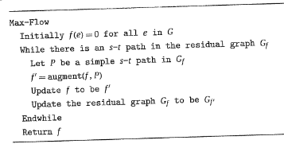
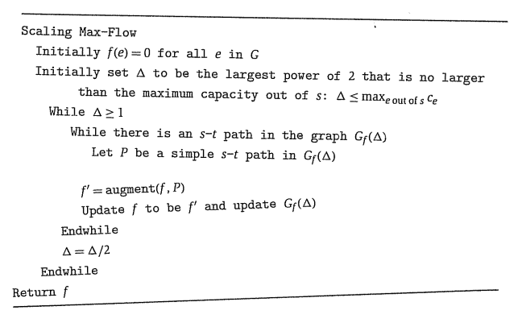
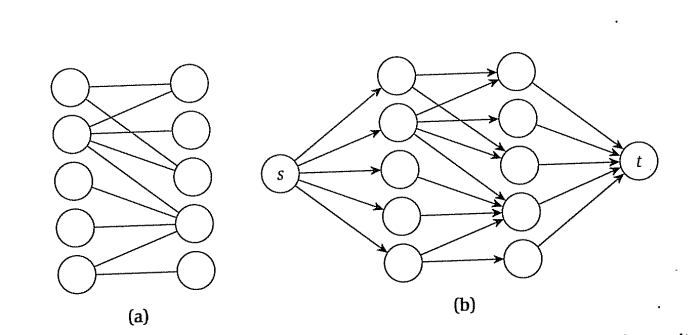

# The Maximum-Flow Problem and the Ford-Fulkerson Algorithm

## Flow network
Digrafo $G=(V,E)$ en el cual:
- Cada arista $e$ (edge) tiene una capacidad $c_e$
- Hay un vértice fuente (source) $s \in V$
- Hay un vértice escape (sink o target) $t \in V$

## Flow
Un flujo (flow) es una función $f:E \to \mathbb{R}^+$ que indica cuánto flujo $f(e)$ pasa por cada arista $e$. Satisface:
- Capacidad: $0\leq f(e)\leq c_e \forall e\in E$
- Conservación: $\sum_{e\in v_{in}} f(e) = \sum_{e\in v_{out}} f(e)$, donde $v_{in} \subset E$ son las aristas entrantes de $v$ y $v_{out}\subset E$ son las salientes de $v$. También puede enunciarse $f^{in}(v)=f^{out}(v) \forall v\in V-\{s,t\}$

Los vértices sink y source no cumplen la regla de la conservación.

## Valor de un flujo

$$v(f)=\sum_{e\in s_{out}} f(e)$$

La suma del flujo saliente de la fuente.

$$v(f)=f^{out}(s)=f^{in}(t)$$

## Problema del flujo máximo

Dada una red de flujo, encontrar un $f$ que maximice $v(f)$.
## Arista inversa
Una función que invierte una arista:
$$\operatorname{rev}((u,v))=(v,u)$$

## Grafo residual (residual graph)

Dada una red $G$ y un flujo $f$, $G_f=(V_f,E_f)$ con capacidades $c^f_e$ es el grafo residual. Cumple:
- Los mismos vértices: $V_f=V$
- Las aristas originales ahora tienen capacidad residual: $c^f_e=c_e-f(e)$
- Se agregan aristas inversas cuya capacidad es el flujo de la original:
  - $E´_f=\{\operatorname{rev}(e)\forall e\in E:f(e)>0\}$
  - $E_f=E \cup E´_f$. 
  - $c_{e´}^{f}=f(\operatorname{rev}(e´)) \forall e´\in E´_f$

## Función `bottleneck`
Sea $P$ un camino entre $s$ y $t$ en $G_f$.

$$
\operatorname{bottleneck}(P,f)=\min_{e\in P} (c_e^f)
$$

Es decir, es la mínima capacidad residual en $P$: acota cuánto flujo más puedo meter en $P$.

## Operación $\operatorname{augment}$
Recordando que $P$ es un camino por $G_f$, pero que $f$ tiene como domínio las aristas de $G$. La operación $\operatorname{augment}(f,P)$ devuelve un nuevo flujo $f´$ que cumple:
- $f'(e)=f(e)+\operatorname{bottleneck}(P,f)$ si $e\in P$
- $f'(e)=f(e)-\operatorname{bottleneck}(P,f)$ si $rev(e)\in P$
- $f'(e)=f(e)$ de lo contrario

## Algoritmo Ford-Fulkerson

## Propiedades del algoritmo FF
DEMOSTRACIONES PENDIENTES

- (7.2) La imagen de $f$ está contenida en $\mathbb{N}$.
- (7.3) $\operatorname{augment}(f,P)=f´ \Rightarrow v(f´)>v(f)$
- (7.4) FF toma como mucho $\sum_{e\in s_{out}}c_e$ iteraciones
- (7.5) FF es $O(m \sum_{e\in s_{out}}c_e)$ (por 7.4)

# 7.2: Max-flow y min-cuts
- **Corte $s$-$t$**: una partición $(A,B)$ de $V$ tal que $s\in A$ y $t\in B$.
- **Capacidad de un corte $(A,B)$**: $c(A,B)=\sum_{e \text{ saliente de } A} c_e$

DEMOSTRACIONES PENDIENTES:

- (7.6) dado un flujo cualquiera $f$ y un corte $s$-$t$:  $v(f)=f^{out}(A)-f^{in}(A)$
- (7.7) análogo a (7.6) para $B$.
- (7.8) dado un flujo cualquiera $f$ y un corte $s$-$t$:  $v(f)\leq c(A,B)$
- (7.9) Dado un $f$ tal que no hay caminos $s$-$t$ en el grafo residual $G_f$, entonces existe un corte $s$-$t$ $(A^*,B^*)$ in $G$ para el cual $v(f)=c(A^*,B^*)$. En esta situación, $f$ es el flujo máximo y $(A^*,B^*)$ el corte mínimo.
- (7.12) Para todo flujo $f$ existe un corte $(A,B)$ tal que $v(f)=c(A,B)$

# 7.3: Mejor selección de augmenting paths

Siendo $C=\sum_{e\in s_{out}}c_e$:
- (7.16) El while itera como mucho $1+\lceil \log_2 C \rceil$
- (7.20) el algoritmo que escala corre en como mucho $O(m^2 \log_2 C)$

# 7.4: Preflow-push algorithm
Un algoritmo polinómico para Max-Flow.

# 7.5: Bipartite matching
Sea $G=(V,E)$ bipartito. Matching bipartito: encontrar un subconjunto $E^* \subset E$ tal que el grado de cualquier vértice es como mucho 1 en $G^*=(V,E^*)$ y se maximiza $|E^*|$. Se resuelve como un max-flow cuyas aristas tienen capacidad 1. $O(mn)$ usando preflow-push.

# 7.6: Caminos disjuntos
Descubrir cuántos caminos existen entre $s$ y $t$. En un grafo dirigido, se mappea el problema a max-flow con capacidades unitarias. $O(mn)$

En un grafo no dirigido, se agrega una arista dirigida en cada dirección para cada arista no dirigida y se ejecuta el algoritmo de max-flow. $O(mn)$

# 7.8: Survey design
PENDIENTE