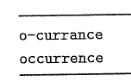

# Sequence alignment
## Planteo

**Palabras** $x$ e $y$, que se denotan como las secuencias ordenadas $x=x_1 x_2 ... x_m$ e $y=y_1 y_2 ... y_n$.

**Posiciones** en cada palabra: son los conjuntos  $P_x = \{ 1, 2, ..., m \} \subset \mathbb{N}$ y $P_y = \{ 1, 2, ..., n \} \subset \mathbb{N}$

## Solución
Un macthing $S \subset P_x \times P_y$ tal que no hay cruces entre los matches, es decir: 

$$
\forall (i,j) \in S, (i',j') \in S: i \lt i', j \lt j'
$$

## Función de costo

Función $\operatorname{gaps}(S)$, cuenta la cantidad de guiones en el matching $S$.

$$
\operatorname{cost}(S)=\delta \operatorname{gaps}(S) + \sum_{(p,q)\in S} \alpha_{x_py_q}
$$

## Planteo recursivo

Para cualquier $(m, n)\in P_x \times P_y$ y una solución óptima $M$, se da uno de:

1. $(m,n)\in M$
2. La posición $m$ de $X$ no está matcheada
3. La posición $n$ de $Y$ no está matcheada

Minimizando sobre las tres decisiones:
$$
\operatorname{opt}(m,n)=\min(\alpha_{x_my_n} + \operatorname{opt}(m-1,n-1), \delta + \operatorname{opt}(m-1,n), \delta + \operatorname{opt}(m,n-1) )
$$

## Algoritmo

El algoritmo explora todo el domínio de $\operatorname{opt}$ en el peor caso, $O(m,n)$. También usa espacio cuadrático (variable $A$).